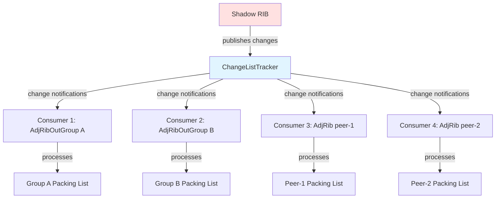

# Change List Integration

## Overview

The Change List (ChangeListTracker) is a publish-subscribe system that efficiently propagates route changes from the Shadow RIB to multiple consumers (AdjRibs and AdjRibOutGroups). This eliminates the need for RIB to directly notify each peer individually, providing better scalability and decoupling.

## Architecture

### Producer-Consumer Model



### Key Components

**Producer (Shadow RIB)**:
- Publishes route changes via `ChangeListTracker::publish()`
- Each `ShadowRibEntry` wrapped in `TrackableObject<ShadowRibEntry>`
- Changes include: new routes, withdrawals, bestpath updates

**Tracker (ChangeListTracker)**:
- Central registry of changes
- Maintains change lists per `TrackableObject`
- Notifies registered consumers when changes occur

**Consumer (AdjRibOutConsumer / AdjRibOutGroupConsumer)**:
- Registers with tracker for change notifications
- Periodically polls change list via timer
- Processes changes into egress packing list

## Data Structures

### TrackableObject

Wraps Shadow RIB entries to track which consumers need updates:

```cpp
template <typename T>
class TrackableObject {
  T value_;  // The actual ShadowRibEntry

  // Bitmap of consumers that need to process this change
  ConsumerBitmap consumerBitmap_;

  // Linked list node for change list
  folly::IntrusiveListHook changeListHook_;
};
```

### ChangeListTracker

```cpp
class ChangeListTracker<ShadowRibEntry> {
  // Name for logging/debugging
  std::string trackerName_;

  // All registered consumers
  std::unordered_map<Consumer*, uint64_t> consumers_;

  // Global callback when change processed
  std::function<void(TrackableObject<ShadowRibEntry>*)> onChangeProcessed_;
};
```

### Consumer

```cpp
class AdjRibOutGroupConsumer : public Consumer<ShadowRibEntry> {
  // Pointer to owning AdjRibOutGroup
  AdjRibOutGroup* group_;

  // Bitmap position assigned by tracker
  uint64_t bitPosition_;

  // Timer to periodically consume changes
  std::unique_ptr<folly::HHWheelTimer::Callback> consumeTimer_;
};
```

## Registration Flow

### 1. Consumer Registration

When AdjRibOutGroup is created:

```cpp
void AdjRibOutGroup::activateChangeListConsumer() {
  if (!changeListConsumer_) {
    changeListConsumer_ = std::make_unique<AdjRibOutGroupConsumer>(
        this,  // owning group
        changeListTracker_  // global tracker
    );
  }

  // Register with tracker (assigns bit position)
  changeListConsumer_->registerWithTracker();

  // Use polled mode (timer-based consumption)
  changeListConsumer_->setPolledMode();

  // Initialize bitmap for filtering
  changeListConsumer_->setBitmap();

  // Start consumption timer
  scheduleChangeListConsumeTimer();
}
```

### 2. Tracker Assignment

Tracker assigns each consumer a unique bit position:

```cpp
void ChangeListTracker::registerConsumer(Consumer* consumer) {
  uint64_t bitPos = nextBitPosition_++;
  consumers_[consumer] = bitPos;
  consumer->setBitPosition(bitPos);

  XLOGF(DBG2, "Registered consumer at bit position {}", bitPos);
}
```

### 3. Bitmap Setup

Consumer creates bitmap to track "in-sync" peers/groups:

```cpp
void AdjRibOutGroupConsumer::setBitmap() {
  bitmap_ = std::make_shared<ConsumerBitmap>();

  // For update groups: set bit for group's position
  bitmap_->set(bitPosition_);
}
```

## Change Publication Flow

### Publishing Changes

When Shadow RIB updates a route:

```cpp
void PeerManager::handleShadowRibEntryAnnouncement(
    const RibOutAnnouncement& announcement) {

  for (const auto& entry : announcement.entries) {
    auto& trackedEntry = shadowRibEntries_[entry.prefix];

    // Update shadow RIB entry
    trackedEntry->bestpath = /* new bestpath */;

    // Publish to all consumers
    changeListTracker_->publish(
        trackedEntry.get(),  // TrackableObject
        bitmap  // Which consumers need this change
    );
  }
}
```

### Bitmap-Based Filtering

Only consumers with matching bits are notified:

```cpp
void ChangeListTracker::publish(
    TrackableObject<ShadowRibEntry>* obj,
    const ConsumerBitmap& bitmap) {

  // Set consumer bitmap on object
  obj->consumerBitmap_ = bitmap;

  // Notify each consumer whose bit is set
  for (auto& [consumer, bitPos] : consumers_) {
    if (bitmap.test(bitPos)) {
      consumer->notifyChange(obj);
    }
  }
}
```

## Change Consumption Flow

### Periodic Consumption

Consumer timer fires periodically (MRAI interval):

```cpp
void AdjRibOutGroup::scheduleChangeListConsumeTimer() {
  changeListConsumeTimer_->scheduleTimeout(mraiInterval_);
}

// On timer expiry:
void timerCallback() {
  co_await changeListConsumer_->consumeChanges();

  // Reschedule timer
  changeListConsumeTimer_->scheduleTimeout(mraiInterval_);

  // Trigger message building if packing list has entries
  if (!attrToPrefixMap_.empty()) {
    co_await buildAndSendGroupBgpMessages();
  }
}
```

### Processing Changes

Consumer drains its change list:

```cpp
folly::coro::Task<void> AdjRibOutGroupConsumer::consumeChanges() {
  while (auto* trackedObject = getNextChange()) {
    // Extract shadow RIB entry
    ShadowRibEntry& srEntry = trackedObject->get();

    // Process into group's packing list
    group_->processShadowRibEntryChange(srEntry);

    // Clear our bit (mark as processed)
    trackedObject->consumerBitmap_.reset(bitPosition_);

    // Notify tracker
    onChangeProcessed(trackedObject);
  }
}
```

### Completion Callback

After all consumers process a change, tracker cleans up:

```cpp
void PeerManager::processChangeItemCompleteCallback(
    TrackableObject<ShadowRibEntry>* trackedObject) {

  // Check if all consumers processed this change
  if (trackedObject->consumerBitmap_.none()) {
    // All consumers done, remove from change lists
    trackedObject->removeFromChangeList();
  }
}
```

## Polled vs Push Mode

### Polled Mode (Used in BGP++)

**Characteristics**:
- Consumer uses timer to periodically check for changes
- Controlled consumption rate (respects MRAI)
- Better batching of changes

**Usage**:
```cpp
consumer->setPolledMode();
```

**Timer-based consumption**:
```cpp
scheduleTimeout(mraiInterval_);  // e.g., every 30 seconds
```

### Push Mode (Not Currently Used)

**Characteristics**:
- Immediate notification on each change
- Lower latency
- Higher CPU overhead for frequent changes

## Initial Dump Handling

During session establishment, consumer can skip entries already on change list:

```cpp
folly::coro::Task<void> PeerManager::processRibDumpReq(RibDumpReq req) {
  for (const auto& [prefix, trackedEntry] : shadowRibEntries_) {
    auto* trackedObject = trackedEntry.get();

    // Skip if already on consumer's change list
    if (changeListTracker_->isConsumerSetOnTrackableObject(
            trackedObject, consumer)) {
      continue;  // Will be processed via change list
    }

    // Include in initial dump
    announcement.entries.push_back(/* ... */);
  }
}
```

**Benefits**:
- Avoid duplicate processing of same prefix
- Faster initial dump (fewer entries)
- Consistent state (change list has latest data)

## Synchronization

### In-Sync State

Consumer is "in-sync" when:
1. Initial dump completed
2. EoR sent/received
3. Actively consuming from change list

**Checking sync state**:
```cpp
bool isInSync() {
  return egressEoRsSent_ &&  // EoR sent
         changeListConsumer_ &&  // Consumer active
         !initialDumpInProgress_;  // Dump complete
}
```

### Out-of-Sync Scenarios

Consumer becomes out-of-sync when:
- Session terminates
- Consumer deactivated
- Initial dump in progress

**Handling**:
```cpp
void deactivateChangeListConsumer() {
  clearPackingList();  // Discard pending updates

  if (changeListConsumeTimer_) {
    changeListConsumeTimer_->cancelTimeout();
  }

  if (changeListConsumer_) {
    changeListConsumer_->deregisterFromTracker();
    changeListConsumer_.reset();
  }
}
```

## Performance Characteristics

### Scalability

**Traditional Approach (RIB → each peer)**:
- Complexity: O(N) where N = number of peers
- Memory: N separate messages for same route change

**Change List Approach**:
- Complexity: O(1) publication + O(C) consumption where C = consumers
- Memory: Single ShadowRibEntry + bitmap overhead

**Example**:
- 100 peers in 5 update groups
- Route change: 1 publication → 5 consumers (vs 100 direct notifications)
- **20x reduction** in change propagation overhead

### Batching Benefits

Consumer timer allows natural batching:

```
Without batching (push mode):
  Change 1 → Process → Build message
  Change 2 → Process → Build message
  ...
  Change 100 → Process → Build message
  Result: 100 separate processing events

With batching (polled mode, 30s timer):
  Changes 1-100 accumulate in change list
  Timer fires → Process all 100 at once
  Build messages with optimal packing
  Result: 1 processing event, better PDU packing
```

## Memory Management

### Bitmap Overhead

Per `TrackableObject`:
- Bitmap size: Typically 1-8 bytes (depends on consumer count)
- **Example**: 1 million prefixes × 8 bytes = 8 MB

### Change List Overhead

Active changes on list:
- Intrusive list hook: 16 bytes per entry
- **Transient**: Cleared after all consumers process

### Total Overhead

For 1M prefixes with 10 consumers:
- Bitmap: 8 MB
- Active change lists: ~16 MB (if all prefixes changed)
- **Total**: ~24 MB (< 0.01% of total BGP memory)

## Code References

### Core Implementation

- **ChangeTracker.h** (`fbcode/neteng/fboss/bgp/cpp/changeTracker/ChangeTracker.h`)
  - `ChangeListTracker<T>` template
  - Publication and registration logic

- **Consumer.h** (`fbcode/neteng/fboss/bgp/cpp/changeTracker/Consumer.h`)
  - `Consumer<T>` base class
  - Consumption interface

- **ConsumerBitmap.h** (`fbcode/neteng/fboss/bgp/cpp/changeTracker/ConsumerBitmap.h`)
  - Efficient bitmap implementation

### Integration Points

- **AdjRibGroup.cpp**
  - `AdjRibOutGroupConsumer` implementation
  - `processShadowRibEntryChange()` - change processing

- **PeerManager.cpp**
  - Change list tracker creation
  - `handleShadowRibEntryAnnouncement()` - publication
  - `processChangeItemCompleteCallback()` - cleanup

### Testing

- **AdjRibGroupTest.cpp**
  - Change list consumption tests
  - Bitmap-based filtering tests

## Monitoring

### Key Metrics

| Metric | Description |
|--------|-------------|
| `changeListTracker_->size()` | Active changes pending consumption |
| `consumer->changeListSize()` | Changes in consumer's list |
| `consumeChanges()` duration | Time to drain change list |

### Logging

```cpp
XLOGF(DBG3, "Group {}: consumeChanges completed, packingList size={}",
      groupName_, attrToPrefixMap_.size());
```

## Related Documentation

- [Egress Pipeline Overview](egress-pipeline.md)
- [Shadow RIB Integration](shadowrib-integration.md)
- [Egress Backpressure](egress-backpressure.md)
- [Out-Delay](out-delay.md)
- [BGP UPDATE Serialization](serialization.md)
