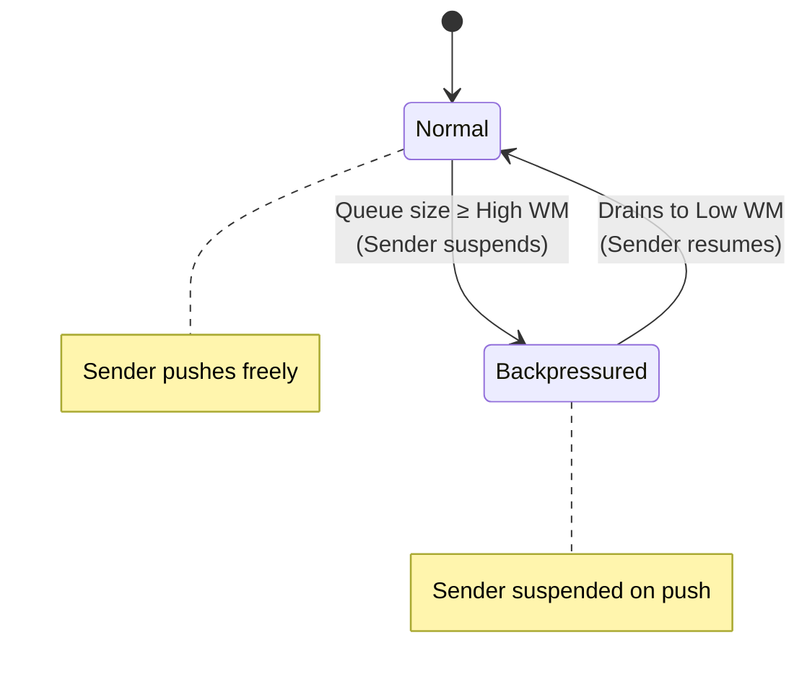

# Egress Queue Backpressure

## Overview

Backpressure is a flow control mechanism that prevents memory exhaustion when the egress queue fills up faster than the IO thread can drain it. This happens when:

- Network congestion slows down socket writes
- Peer has slow TCP receive window
- Large RIB dump in progress
- Multiple route churns in quick succession

## Architecture

### Bounded Queue Design

The egress queue uses a **watermark-based bounded MPMC queue**:

```cpp
MonitoredMPMCWatermarkQueue<BgpUpdate2> boundedAdjRibOutQueue_;

// Default Configuration (nettools/bgplib/BgpStructs.h)
const size_t kMaxEgressQueueSize = 10;
const size_t kEgressQueueHighWatermark = 8;  // 80%
const size_t kEgressQueueLowWatermark = 2;   // 20%
```

### Queue States



## How Backpressure Works

### 1. Producer Side (Sender Coroutine)

When building BGP messages, the sender checks queue capacity before pushing:

```cpp
folly::coro::Task<bool> AdjRib::waitForQueueSpace() {
  while (boundedAdjRibOutQueue_->size() >= kEgressQueueHighWatermark) {
    stats_.incrementEgressQueueBackpressuredEvents();
    auto startTime = std::chrono::steady_clock::now();

    // Suspend until space available
    co_await boundedAdjRibOutQueue_->waitToPush();

    auto blockDuration = std::chrono::steady_clock::now() - startTime;
    stats_.addEgressQueueBlockDuration(blockDuration);
  }
  co_return wasBackpressured;
}
```

**Key Points**:
- Coroutine **suspends** when queue ≥ high watermark
- Resumes automatically when queue drains to low watermark
- No CPU wasted on polling or busy-waiting

### 2. Consumer Side (IO Thread)

The IO thread continuously drains the queue:

```cpp
while (auto maybeMsg = adjRibOutQueue_->pop()) {
  auto bgpUpdate = *maybeMsg;

  // Serialize BgpUpdate2 to wire format
  auto pdu = serializeBgpUpdate(bgpUpdate);

  // Write to AsyncSocket
  asyncSocket_->writeChain(nullptr, std::move(pdu));

  stats_.incrementSentUpdateMsgs();
}
```

**Automatic Resume**:
- When queue size drops to low watermark, semaphore signals waiting producers
- Suspended sender coroutines wake up and resume pushing

## Interaction with Change List Consumer

Backpressure affects when the change list consumer can process new updates:

```cpp
void AdjRib::activateChangeListConsumer() {
  if (isEnableEgressQueueBackpressure()) {
    scheduleSendBgpUpdates();  // Drain packing list first
  }

  if (!changeListConsumer_) {
    // Create consumer...
  }

  if (enableEgressQueueBackpressure_ && !egressEoRsSent_) {
    // Block change list consumption until EoR sent
    return;
  }

  // Start consuming from change tracker
  changeListConsumeTimer_->scheduleTimeout(mraiInterval_);
}
```

**Coordination**:
1. During initial dump: Prioritize draining packing list over consuming new changes
2. After EoR sent: Allow change list consumer to run
3. If backpressured: Sender suspends, change list consumption continues (fills packing list)

## Backpressure Scenarios

### Scenario 1: RIB Initial Dump

```
Time    Queue Size    Action
────────────────────────────────────────────────
T0      0             Start initial dump
T1      5             Building messages normally
T2      8             Hit high watermark!
T3      8             Sender suspends, waiting...
T4      2             IO thread drains to low watermark
T5      2             Sender resumes, continues dump
```

### Scenario 2: Route Churn Spike

```
Event: 1000 routes withdrawn due to peer failure

1. Change list consumer processes withdrawals
2. Packing list grows to 1000 prefixes
3. Sender starts building withdrawal messages
4. Queue fills to high watermark (8) after ~8 messages
5. Sender suspends until IO thread drains queue
6. Process repeats in cycles until all 1000 processed
```

### Scenario 3: Slow Peer Network

```
Symptom: TCP send buffer full, writes blocked

1. IO thread blocks on AsyncSocket::write()
2. Queue accumulates BgpUpdate2 messages
3. Reaches high watermark
4. Sender suspends
5. Eventually TCP ACKs arrive, send buffer drains
6. IO thread resumes writing
7. Queue drains to low watermark
8. Sender resumes
```

## Statistics and Monitoring

### Key Metrics

| Metric | Description | ODS Key |
|--------|-------------|---------|
| `egressQueueBackpressuredEvents` | Count of suspensions | `bgp.peer.{peer}.egress_queue_backpressured` |
| `egressQueueBlockDuration` | Total time blocked (ms) | `bgp.peer.{peer}.egress_queue_block_duration_ms` |
| `lastEgressQueueBlockTime` | Timestamp of last block | `bgp.peer.{peer}.last_egress_queue_block_time` |
| `egressQueueSize` | Current queue depth | `bgp.peer.{peer}.egress_queue_size` |

### Alerting Thresholds

- **Warning**: Backpressure events > 10/minute
- **Critical**: Queue at high watermark for > 60 seconds
- **Investigate**: Average block duration > 5 seconds

## Configuration

### Enabling Backpressure

Backpressure is enabled per-peer via `enableEgressQueueBackpressure()`:

```cpp
adjRib->enableEgressQueueBackpressure(true);
```

**When to Enable**:
- ✅ Production peers with large RIBs
- ✅ Peers with unreliable networks
- ✅ Memory-constrained environments

**When to Disable**:
- ⚠️ Test environments (for simplicity)
- ⚠️ Stream subscribers (non-BGP consumers)

### Production Parameters

The production egress queue parameters are defined in `nettools/bgplib/BgpStructs.h`:

```cpp
const size_t kMaxEgressQueueSize{10};
const size_t kEgressQueueHighWatermark{8};   // 80% of max
const size_t kEgressQueueLowWatermark{2};    // 20% of max
```

These values are intentionally small to provide tight backpressure control and prevent memory issues.

**Note**: Test code may use larger values (e.g., 10000/8000/2000 via DEFINE_int32 flags in AdjRibInUtils.h) to simulate different scenarios, but production always uses the values from BgpStructs.h.

## Code References

### Implementation Files

- **AdjRib.cpp** (`fbcode/neteng/fboss/bgp/cpp/adjrib/AdjRib.cpp`)
  - `waitForQueueSpace()`: Backpressure suspension logic
  - `sendPendingEoRs()`: EoR handling with backpressure
  - `sendBgpUpdates()`: Main sender coroutine with queue checks

- **AdjRibGroup.cpp** (`fbcode/neteng/fboss/bgp/cpp/adjrib/AdjRibGroup.cpp`)
  - `distributeMessageToInSyncPeers()`: Group-level backpressure coordination

### Test Files

- **AdjRibOutBackpressureTest.cpp** (`fbcode/neteng/fboss/bgp/cpp/tests/AdjRibOutBackpressureTest.cpp`)
  - `WaitForQueueSpaceTest`: Tests suspension and resume
  - `SendPendingEoRsTest`: EoR with backpressure
  - `SendBgpUpdateMessagesTest_*`: Various backpressure scenarios

## Related Documentation

- [Egress Pipeline Overview](egress-pipeline.md)
- [Out-Delay](out-delay.md)
- [Change List Integration](changelist-integration.md)
- [Shadow RIB Integration](shadowrib-integration.md)
- [BGP UPDATE Serialization](serialization.md)
