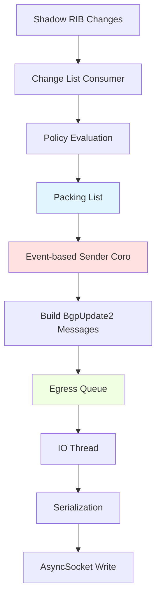

# BGP++ Egress Pipeline

## Overview

The BGP++ egress pipeline is responsible for advertising routes to BGP peers. Starting from the AdjRibOut (Adjacency RIB-Out), the pipeline efficiently packs route updates and sends them to peers through a multi-stage, event-driven architecture.


## Incremental Migration: Three Pipeline Flavors

The codebase is currently in an **incremental migration** from the original synchronous egress pipeline to more scalable, asynchronous architectures. As a result, **three distinct flavors** of the egress pipeline coexist:

### 1. Original Pipeline (Synchronous, No Backpressure)

**Characteristics**:
- Messages built **synchronously** in RIB processing context
- No bounded queue or flow control
- Immediate `buildAndSendBgpMessages()` call after packing list updates
- Packing list cleared immediately after message building

**When Used**:
- **Default mode** for BGP peers (`enableEgressQueueBackpressure = false`)
- Stream subscribers (non-BGP consumers)
- Test environments

**Code Path**:
```cpp
void AdjRib::processRibOutAnnouncement(const RibOutAnnouncement& announcement) {
  // Build packing list...

  if (!enableEgressQueueBackpressure_) {
    buildAndSendBgpMessages();  // ← Synchronous
    attrToPrefixMap_.clear();
  }
}
```

### 2. Per-Peer Egress Backpressure

**Characteristics**:
- **Asynchronous** sender coroutine per peer
- **Bounded egress queue** with watermark-based backpressure
- Sender suspends when queue reaches high watermark (8/10 messages)
- Each peer has independent packing list and sender coroutine

**When Used**:
- Production BGP peers with `enableEgressQueueBackpressure = true`
- `enableUpdateGroup = false`

**Code Path**:
```cpp
void AdjRib::processRibOutAnnouncement(const RibOutAnnouncement& announcement) {
  // Build packing list...

  if (enableEgressQueueBackpressure_) {
    scheduleSendBgpUpdates();  // ← Asynchronous coroutine
  }
}

folly::coro::Task<void> AdjRib::sendBgpUpdates() {
  while (!attrToPrefixMap_.empty()) {
    co_await waitForQueueSpace();  // ← Suspend on backpressure
    // Build and enqueue messages...
  }
}
```

**See**: [Egress Backpressure](egress-backpressure.md)

### 3. Update Group Pipeline

**Characteristics**:
- **Group-level** packing list and sender coroutine
- Single message built **once**, distributed to **N peers** in group
- **Bounded queues** per peer with backpressure
- **Zero-copy distribution** with per-peer nexthop mutation
- Peers grouped by identical egress policy and capabilities

**When Used**:
- Production with `enableUpdateGroup = true` and `enableEgressQueueBackpressure = true`
- Peers with identical egress policies form update groups

**Code Path**:
```cpp
folly::coro::Task<void> AdjRibOutGroup::buildAndSendGroupBgpMessages() {
  while (!attrToPrefixMap_.empty()) {
    // Build message ONCE at group level
    auto message = buildGroupUpdateWithSizeEstimation(...);

    // Distribute to all peers in group
    co_await distributeMessageToInSyncPeers(message, ...);
  }
}
```

**See**: [BGP UPDATE Serialization](serialization.md) for zero-copy optimization details

### Migration Path

```
Original (Synchronous)  ← Current default
    ↓
Per-Peer Backpressure   ← Gradual rollout
    ↓
Update Groups           ← Target architecture
```

**Configuration Flags**:
```cpp
struct BgpGlobalConfig {
  bool enableEgressQueueBackpressure{false};  // Enable bounded queues
  bool enableUpdateGroup{false};              // Enable update groups
  bool enableSerializeGroupPdu{false};        // Enable zero-copy optimization
};
```

**Feature Dependencies**:
- Update groups **require** egress backpressure enabled
- Zero-copy serialization **requires** update groups enabled
- Change list tracker **required** for egress backpressure

### Coexistence in Production

All three flavors can run **simultaneously** in the same BGP++ process:
- Regular BGP peers: Original synchronous (default) or per-peer backpressure (opt-in)
- With update groups enabled: Grouped peers use flavor #3, ungrouped use flavor #2
- Stream subscribers: Always original synchronous pipeline
- Test/debug peers: Any flavor via per-peer `enableEgressQueueBackpressure()`

## Pipeline Architecture



### Key Components

#### 1. Packing List (attrToPrefixMap_)

When route updates are received from the RIB, they are placed into a **packing list** - a map that groups prefixes by their BGP attributes:

- **Data Structure**: `folly::F14FastMap<BgpPathWithAfi, PrefixSet>`
  - Key: `(BgpPath attributes, AFI)` pair
  - Value: Set of `(prefix, pathId)` tuples
- **Purpose**: Efficiently pack multiple prefixes with identical attributes into a single BGP UPDATE message
- **Location**: `AdjRib::attrToPrefixMap_` (per-peer) or `AdjRibOutGroup::attrToPrefixMap_` (update group)

#### 2. Event-Based Sender Coroutine

The pipeline uses coroutines to asynchronously build and send BGP UPDATE messages:

- **Per-Peer Mode**: `AdjRib::sendBgpUpdates()` - processes packing list for individual peers
- **Update Group Mode**: `AdjRibOutGroup::buildAndSendGroupBgpMessages()` - processes once per group, distributes to N peers
- **Triggering**: Event-driven via change list consumer or timer expiry

The sender coroutine:
1. Iterates through the packing list
2. Packs prefixes into `BgpUpdate2` thrift messages (respecting PDU size limits ~4KB)
3. Enqueues messages to the bounded egress queue
4. Removes processed entries from packing list

#### 3. BgpUpdate2 Thrift Collection

Routes are packed into the `BgpUpdate2` thrift structure:

```cpp
struct BgpUpdate2 {
  // IPv4 announcements (legacy format) - DEPRECATED
  std::vector<RiggedIPPrefix> v4Announced2;

  // IPv4 withdrawals (legacy format)
  std::vector<RiggedIPPrefix> v4Withdrawn2;

  // IPv4 AND IPv6 announcements (MP_REACH_NLRI)
  // Both address families use this field with different AFI values
  optional MpReachNlri mpAnnounced;

  // IPv6 withdrawals (MP_UNREACH_NLRI)
  optional MpUnreachNlri mpWithdrawn;

  // BGP Path Attributes
  optional BgpAttrs attrs;
}
```

**Important**: Both IPv4 and IPv6 announcements use `mpAnnounced` with MP_REACH_NLRI (RFC 4760). The address family is distinguished by the `afi` field (AFI_IPv4 or AFI_IPv6) within the MpReachNlri structure.

**Packing Optimizations**:
- Size estimation prevents exceeding BGP PDU limits
- Prefixes with identical attributes packed together
- Separate messages for announcements vs withdrawals
- Add-path support with per-prefix path IDs

#### 4. Egress Queue (boundedAdjRibOutQueue_)

Messages are pushed to a **bounded MPMC queue** with watermark-based backpressure:

- **Type**: `MonitoredMPMCWatermarkQueue<BgpUpdate2>`
- **Capacity**: Configurable (default: `kMaxEgressQueueSize`)
- **Watermarks**:
  - High watermark: Triggers backpressure
  - Low watermark: Resumes processing
- **Behavior**: Sender coroutines suspend when queue is full (`waitForQueueSpace()`)

**See**: [Backpressure Documentation](egress-backpressure.md)

#### 5. IO Thread Processing

The peer's IO thread consumes from the egress queue:

1. **Dequeue**: `adjRibOutQueue_->pop()` retrieves the next `BgpUpdate2` message
2. **Serialization**: Convert thrift message to wire format (BGP PDU bytes)
3. **Write to Socket**: `AsyncSocket::writeChain()` sends bytes to the peer
4. **Update Stats**: Track sent messages, announcements, withdrawals

**Current State**: Serialization happens synchronously in IO thread (future: offload to worker thread)

**See**: [BGP UPDATE Serialization](serialization.md)

## Flow Example

### Announcement Flow

```
1. RIB computes new best path for 10.0.0.0/24
   └─> RibOutAnnouncement sent to PeerManager

2. PeerManager updates Shadow RIB entry
   └─> Publishes change to ChangeListTracker

3. AdjRibOutGroup's ChangeListConsumer triggers
   └─> Processes shadow RIB entry change
   └─> Policy evaluation:
       ├─> Check policy cache for (attrs, peer) tuple
       ├─> Cache hit: Use cached post-policy attributes
       └─> Cache miss: Run egress policy, cache result
   └─> Adds (prefix, pathId) to packing list with post-policy attributes

4. Event-based sender wakes up
   └─> Groups 10.0.0.0/24 with other prefixes sharing attributes
   └─> Builds BgpUpdate2 with mpAnnounced = [10.0.0.0/24, ...]
   └─> Pushes to bounded egress queue (may wait if queue full)

5. IO thread dequeues BgpUpdate2
   └─> Serializes to BGP UPDATE PDU bytes
   └─> Writes to AsyncSocket for peer connection
```

### Withdrawal Flow

```
1. RIB withdraws prefix 10.0.0.0/24
   └─> RibOutWithdrawal sent to PeerManager

2. PeerManager removes from Shadow RIB
   └─> Publishes change to ChangeListTracker

3. AdjRibOutGroup processes withdrawal
   └─> Adds (prefix, pathId) to packing list with nullptr attributes

4. Sender builds BgpUpdate2 with v4Withdrawn2 = [10.0.0.0/24]
   └─> Enqueues to egress queue

5. IO thread sends withdrawal PDU to peer
```

## Features

### Update Groups

When multiple peers have identical egress policies and session parameters, they form an **update group**:

- **Benefit**: Build `BgpUpdate2` message **once**, distribute to **N** peers
- **Grouping Key**: Egress policy, out-delay, AFI capabilities, session type, etc.
- **Distribution**: `distributeMessageToInSyncPeers()` handles per-peer nexthop rewriting
- **Implementation**: `AdjRibOutGroup` manages group-level packing list

**See**: [Update Group]()

### Backpressure

Queue-based flow control to prevent memory exhaustion when the egress queue fills up faster than the IO thread can drain it.

**See**: [Egress Backpressure](egress-backpressure.md)

### Out-Delay

Configurable delay before advertising routes to prevent traffic funneling and provide route dampening.

**See**: [Out-Delay](out-delay.md)

## Integrations

### Shadow RIB

The Shadow RIB is the source of truth for routes to advertise:

- **Data Structure**: `shadowRibEntries_` - Map of `prefix -> ShadowRibEntry`
- **Bestpath & Multipaths**: Stores computed best path and ECMP multipaths
- **Change Tracking**: Each entry is a `TrackableObject` monitored by ChangeListTracker
- **Initial Dump**: On session establishment, `buildInitialDumpFromShadowRib()` walks the Shadow RIB

**See**: [Shadow RIB Integration](shadowrib-integration.md)

### Change List Integration

The pipeline integrates with the **ChangeListTracker** for efficient change propagation:

- **Producer**: Shadow RIB publishes route changes
- **Consumer**: Each AdjRibOutGroup registers a consumer
- **Polling**: Consumer periodically drains change list into packing list
- **Bitmaps**: Efficiently track which consumers need which changes

**See**: [Change List Integration](changelist-integration.md)

### Policy Cache

The egress pipeline includes a lookup during policy evaluation to a policy cache. The policy cache takes advantage of the fact that the policy engine indicates the "modifiable attributes" given the configured policy. Since policy evaluation is CPU-intensive, we would like to avoid doing repeat evaluation as much as possible.

**Performance Benefits**:
- Significant CPU savings when multiple prefixes share the same attributes
- Avoids redundant policy evaluation for the same attribute combinations
- Cache size configured via `kMaxPolicyCacheEntries` (default: 40,000 entries)

## Code References

### Key Files

- **AdjRib**: `fbcode/neteng/fboss/bgp/cpp/adjrib/AdjRib.{h,cpp}`
  - Per-peer egress pipeline
  - Packing list management
  - Individual peer message building

- **AdjRibOutGroup**: `fbcode/neteng/fboss/bgp/cpp/adjrib/AdjRibGroup.{h,cpp}`
  - Update group egress pipeline
  - Group-level packing and distribution
  - Change list consumer integration

- **PeerManager**: `fbcode/neteng/fboss/bgp/cpp/peer/PeerManager.cpp`
  - Shadow RIB management
  - Route distribution orchestration
  - IO thread message processing

### Key Functions

| Function | Location | Purpose |
|----------|----------|---------|
| `buildAndSendGroupBgpMessages()` | `AdjRibGroup.cpp:1234` | Event-based sender coroutine for update groups |
| `distributeMessageToInSyncPeers()` | `AdjRibGroup.cpp:890` | Distributes BgpUpdate2 to all group peers |
| `buildGroupUpdateWithSizeEstimation()` | `AdjRibGroup.cpp:756` | Packs prefixes into BgpUpdate2 with size limits |
| `tryUpdateAttrToPrefixMapForGroup()` | `AdjRibCommon.cpp:45` | Updates packing list when attributes change |
| `processShadowRibEntryChange()` | `AdjRibGroup.cpp:567` | Consumes shadow RIB changes into packing list |
| `waitForQueueSpace()` | `AdjRib.cpp:2345` | Backpressure: waits until queue has capacity |

## Performance Characteristics

### Memory Efficiency

- **Update Groups**: Single packing list for N peers (vs N separate lists)
- **Attribute Sharing**: BgpPath objects shared via `shared_ptr` across prefixes
- **Zero-Copy Distribution**: When nexthops identical, share same BgpUpdate2 message

### CPU Efficiency

- **Update Groups**: All work is done serially (single-threaded), but update groups reduce the total amount of work. Instead of building the same message N times (once per peer), we build it once and distribute to N peers.
- **Batching**: Pack multiple prefixes per message (reduces overhead)
- **Event-Driven**: Coroutines suspend during backpressure (no busy-waiting)
- **Policy Caching**: Egress policy results cached per (attrs, peer) tuple

### Latency Characteristics

- **Normal Operation**: Sub-millisecond from Shadow RIB change to queue
- **Under Backpressure**: Sender suspends until queue drains to low watermark
- **Out-Delay**: Intentional delay (configurable, typically seconds) for route dampening

## Testing

### Unit Tests

- `AdjRibOutTest.cpp`: Per-peer egress pipeline and message building
- `AdjRibGroupTest.cpp`: Update group packing and distribution
- `AdjRibOutBackpressureTest.cpp`: Backpressure scenarios and queue behavior
- `AdjRibInUtils.cpp`: Helper utilities for testing egress pipeline

### Test Coverage

- ✅ Packing list updates (additions, withdrawals, attribute changes)
- ✅ BgpUpdate2 message building with size limits
- ✅ Distribution to multiple peers with per-peer nexthop rewriting
- ✅ Backpressure and queue suspension
- ✅ Change list consumer integration

## Related Documentation

- [Egress Backpressure](egress-backpressure.md) - Flow control and queue management
- [Out-Delay](out-delay.md) - Route dampening and delayed advertisements
- [Change List Integration](changelist-integration.md) - Efficient change propagation
- [Shadow RIB Integration](shadowrib-integration.md) - Source of truth for route advertisements
- [BGP UPDATE Serialization](serialization.md) - Converting BgpUpdate2 to wire format
- [Ingress/Egress Policy Cache]() - Efficient policy evaluation with caching
