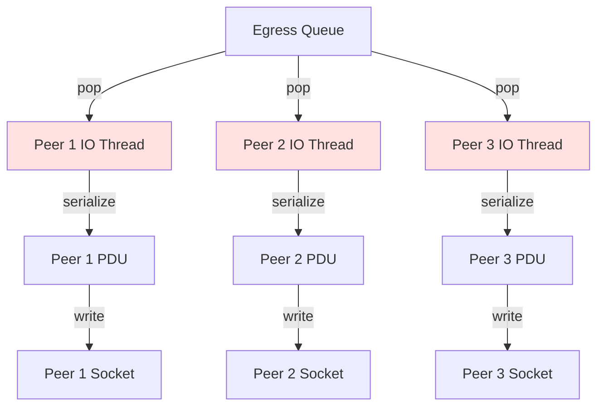
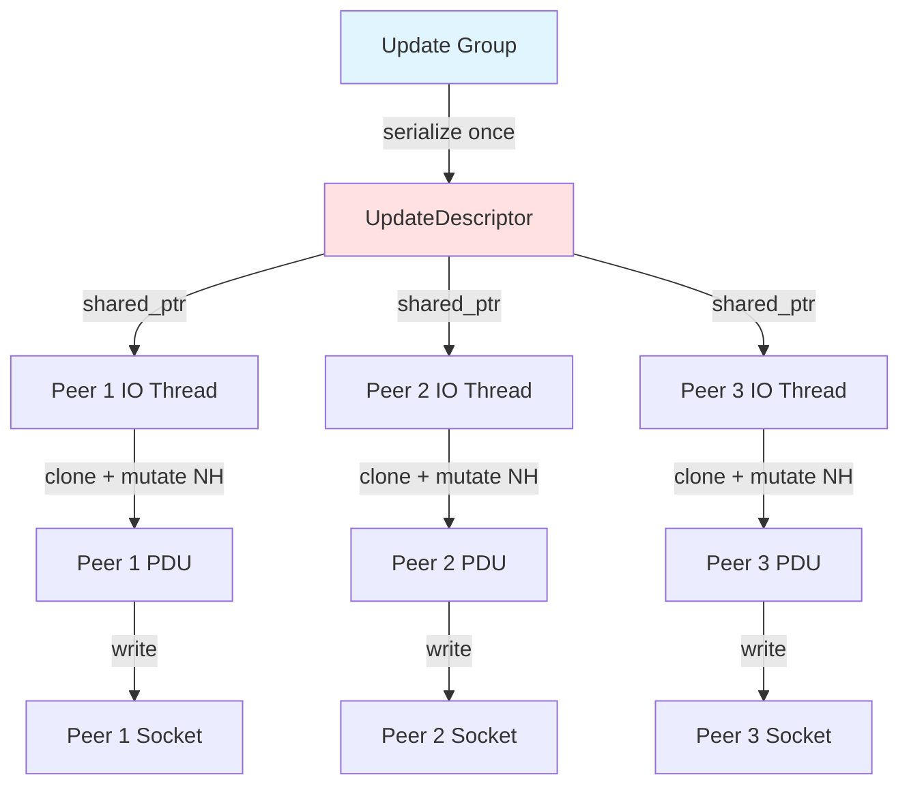

# BGP UPDATE Message Serialization

## Overview

BGP UPDATE message serialization is the process of converting the internal `BgpUpdate2` thrift structure into wire-format BGP PDU bytes that can be sent over the TCP socket to peers. BGP++ supports two serialization approaches:

1. **Per-Peer Serialization**: Each peer's IO thread serializes messages independently
2. **Group Serialization (Zero-Copy)**: Update groups serialize once and distribute with nexthop mutation

## Wire Format Overview

BGP UPDATE messages follow the RFC 4271 format:

```
 0                   1                   2                   3
 0 1 2 3 4 5 6 7 8 9 0 1 2 3 4 5 6 7 8 9 0 1 2 3 4 5 6 7 8 9 0 1
+-+-+-+-+-+-+-+-+-+-+-+-+-+-+-+-+-+-+-+-+-+-+-+-+-+-+-+-+-+-+-+-+
|                                                               |
+                                                               +
|                                                               |
+                                                               +
|                           Marker                              |
+                                                               +
|                                                               |
+-+-+-+-+-+-+-+-+-+-+-+-+-+-+-+-+-+-+-+-+-+-+-+-+-+-+-+-+-+-+-+-+
|          Length               |      Type (2=UPDATE)          |
+-+-+-+-+-+-+-+-+-+-+-+-+-+-+-+-+-+-+-+-+-+-+-+-+-+-+-+-+-+-+-+-+
|   Withdrawn Routes Length (2 octets)                          |
+-+-+-+-+-+-+-+-+-+-+-+-+-+-+-+-+-+-+-+-+-+-+-+-+-+-+-+-+-+-+-+-+
|   Withdrawn Routes (variable)                                 |
+-+-+-+-+-+-+-+-+-+-+-+-+-+-+-+-+-+-+-+-+-+-+-+-+-+-+-+-+-+-+-+-+
|   Total Path Attribute Length (2 octets)                      |
+-+-+-+-+-+-+-+-+-+-+-+-+-+-+-+-+-+-+-+-+-+-+-+-+-+-+-+-+-+-+-+-+
|   Path Attributes (variable)                                  |
+-+-+-+-+-+-+-+-+-+-+-+-+-+-+-+-+-+-+-+-+-+-+-+-+-+-+-+-+-+-+-+-+
|   Network Layer Reachability Information (variable)           |
+-+-+-+-+-+-+-+-+-+-+-+-+-+-+-+-+-+-+-+-+-+-+-+-+-+-+-+-+-+-+-+-+
```

**Key Components**:
- **Marker**: 16 bytes, all ones (0xFF...)
- **Length**: Total message length (including header)
- **Type**: Message type (2 for UPDATE)
- **Withdrawn Routes**: IPv4 prefixes being withdrawn
- **Path Attributes**: BGP attributes (ORIGIN, AS_PATH, NEXT_HOP, etc.)
- **NLRI**: Network Layer Reachability Information (announced IPv4 prefixes)

### Multi-Protocol Extensions (MP-BGP)

For IPv6 and other address families, MP_REACH_NLRI and MP_UNREACH_NLRI attributes are used:

```
MP_REACH_NLRI (Type Code 14):
+-+-+-+-+-+-+-+-+-+-+-+-+-+-+-+-+-+-+-+-+-+-+-+-+-+
| Address Family Identifier (2 octets)            |
+-+-+-+-+-+-+-+-+-+-+-+-+-+-+-+-+-+-+-+-+-+-+-+-+-+
| Subsequent AFI (1 octet)                        |
+-+-+-+-+-+-+-+-+-+-+-+-+-+-+-+-+-+-+-+-+-+-+-+-+-+
| Length of Next Hop (1 octet)                    |
+-+-+-+-+-+-+-+-+-+-+-+-+-+-+-+-+-+-+-+-+-+-+-+-+-+
| Network Address of Next Hop (variable)          |
+-+-+-+-+-+-+-+-+-+-+-+-+-+-+-+-+-+-+-+-+-+-+-+-+-+
| Reserved (1 octet)                              |
+-+-+-+-+-+-+-+-+-+-+-+-+-+-+-+-+-+-+-+-+-+-+-+-+-+
| NLRI (variable)                                 |
+-+-+-+-+-+-+-+-+-+-+-+-+-+-+-+-+-+-+-+-+-+-+-+-+-+
```

## BgpUpdate2 Structure

The internal representation before serialization:

```cpp
struct BgpUpdate2 {
  // IPv4 announcements (legacy format) - DEPRECATED
  std::vector<RiggedIPPrefix> v4Announced2;

  // IPv4 withdrawals (legacy format) - BUT STILL IN USE
  std::vector<RiggedIPPrefix> v4Withdrawn2;

  // IPv4 AND IPv6 announcements (MP_REACH_NLRI)
  // Both address families use this field with different AFI values
  optional<MpReachNlri> mpAnnounced;

  // IPv6 withdrawals (MP_UNREACH_NLRI)
  optional<MpUnreachNlri> mpWithdrawn;

  // BGP Path Attributes
  optional<BgpAttrs> attrs;
};

struct MpReachNlri {
  BgpUpdateAfi afi;        // AFI_IPv4 (1) or AFI_IPv6 (2)
  BgpUpdateSafi safi;      // SAFI_UNICAST (1)
  BinaryAddress nexthop;   // Next hop address (4 or 16 bytes)
  vector<RiggedIPPrefix> prefixes;  // Announced prefixes
};

struct RiggedIPPrefix {
  IPPrefix prefix;
  uint32_t pathId;  // For add-path support
};

struct BgpAttrs {
  optional<BgpAttrOrigin> origin;
  optional<BgpAttrAsPath> asPath;
  optional<string> nexthop;  // Nexthop as string
  optional<uint32_t> med;
  optional<uint32_t> localPref;
  optional<vector<BgpAttrCommunity>> communities;
  optional<vector<BgpAttrExtCommunity>> extCommunities;
  // ... many more attributes
};
```

**Important**: Both IPv4 and IPv6 announcements use MP_REACH_NLRI (RFC 4760). The `v4Announced2` field exists for legacy compatibility but is **not used** in BGP++ production code.

### How Prefixes Are Packed

The following code from `AdjRibGroup.cpp` shows how both IPv4 and IPv6 prefixes are placed into `mpAnnounced`:

```cpp
std::shared_ptr<nettools::bgplib::BgpUpdate2> update;

if (postOutAttrs) {
  /* Case 1: Announcement (both IPv4 and IPv6) */
  update = postOutAttrs->getBgpUpdate2();
  update->mpAnnounced()->afi() = afi;  // AFI_IPv4 or AFI_IPv6
  update->mpAnnounced()->safi() =
      nettools::bgplib::BgpUpdateSafi::SAFI_UNICAST;
  update->mpAnnounced()->nexthop() =
      network::toBinaryAddress(postOutAttrs->getNexthop());

  packGroupPrefixesWithLimit(
      kApproxSerializedAttrLen,
      prefixPathIds,
      *update->mpAnnounced()->prefixes(),  // Both v4 and v6 go here
      groupKey_.sendAddPath);

} else {
  /* Case 2: Withdrawal */
  update = std::make_shared<nettools::bgplib::BgpUpdate2>();
  update->mpWithdrawn()->afi() = afi;  // AFI_IPv4 or AFI_IPv6
  update->mpWithdrawn()->safi() =
      nettools::bgplib::BgpUpdateSafi::SAFI_UNICAST;

  packGroupPrefixesWithLimit(
      0,
      prefixPathIds,
      *update->mpWithdrawn()->prefixes(),
      groupKey_.sendAddPath);
}
```

As you can see, the `afi` field is set to either `AFI_IPv4` or `AFI_IPv6`, and in both cases, prefixes are packed into `mpAnnounced->prefixes()`.

## Serialization Approaches

### 1. Per-Peer Serialization (Traditional)

Each peer serializes BGP UPDATE messages independently in their IO thread.

#### Flow



#### Implementation

Serialization happens in the IO thread when dequeuing from `adjRibOutQueue_`:

```cpp
// Pseudo-code for per-peer serialization
while (auto maybeMsg = adjRibOutQueue_->pop()) {
  folly::variant_match(
      **maybeMsg,
      [&](std::shared_ptr<const BgpUpdate2> update) {
        // Serialize BgpUpdate2 to wire format
        auto serializedPdu =
            nettools::bgplib::BgpMessageSerializer::serializeBgpUpdate2(
                *update,
                as4ByteCapable_,
                extNhEncodingCapable_
            );

        // Write to AsyncSocket
        asyncSocket_->writeChain(nullptr, std::move(serializedPdu));

        stats_.incrementSentUpdateMsgs();
      },
      // ... other message types
  );
}
```

**Characteristics**:
- **Simple**: Straightforward serialization per peer
- **Independent**: Each peer has its own PDU with per-peer nexthop
- **CPU Cost**: N serializations for N peers (redundant work for update groups)

### 2. Group Serialization (Zero-Copy Optimization)

Update groups serialize **once** at the group level and distribute an `UpdateDescriptor` containing:
- Shared serialized PDU (immutable, zero-copy via `shared_ptr<const IOBuf>`)
- Nexthop offset information
- Per-peer nexthop values (mutated at IO time)

#### Flow



#### UpdateDescriptor Structure

```cpp
struct UpdateDescriptor {
  // Shared serialized PDU (zero-copy across all peers)
  std::shared_ptr<const folly::IOBuf> serializedGroupPDU;

  // Nexthop values for mutation
  folly::IPAddress v4Nexthop;
  folly::IPAddress v6Nexthop;

  // Offsets where nexthop appears in serialized PDU
  // tuple<offset, length, isV6>
  std::vector<std::tuple<size_t, size_t, bool>> nexthopOffsets;
};
```

#### Group-Level Serialization

```cpp
folly::coro::Task<void> AdjRibOutGroup::distributeMessageToInSyncPeers(
    const std::shared_ptr<BgpUpdate2>& message,
    const std::shared_ptr<const BgpPath>& postOutAttrs,
    BgpUpdateAfi afi) {

  UpdateDescriptor groupDescriptor;

  if (enableSerializeGroupPdu_) {
    // Serialize ONCE at group level
    groupDescriptor = AdjRibGroupSerializer::serializeUpdateAndCreateDescriptor(
        *message,
        groupKey_.as4ByteCapable,
        groupKey_.extNhEncodingCapable
    );

    if (!groupDescriptor.serializedGroupPDU) {
      XLOGF(ERR, "Group {} failed to serialize, skipping", groupName_);
      co_return;
    }
  }

  // Distribute to all peers in group
  for (const auto& [bitPos, adjRib] : bitToAdjRibs_) {
    if (enableSerializeGroupPdu_) {
      // Zero-copy distribution
      UpdateDescriptor peerDescriptor = groupDescriptor;

      // Compute per-peer nexthop
      auto peerNexthop = adjRib->getNewNexthopFromAttributesOut(
          afi == BgpUpdateAfi::AFI_IPv4, postOutAttrs);

      // Set peer-specific nexthop
      if (peerNexthop.isV4()) {
        peerDescriptor.v4Nexthop = peerNexthop;
      } else {
        peerDescriptor.v6Nexthop = peerNexthop;
      }

      // Push descriptor to peer's queue
      co_await adjRib->boundedAdjRibOutQueue_->push(
          std::make_shared<UpdateDescriptor>(peerDescriptor)
      );
    } else {
      // Traditional: push BgpUpdate2 (peer serializes)
      co_await adjRib->boundedAdjRibOutQueue_->push(message);
    }
  }
}
```

#### IO Thread Nexthop Mutation

The IO thread receives `UpdateDescriptor` and mutates only the nexthop bytes:

```cpp
// Pseudo-code for IO thread processing UpdateDescriptor
folly::variant_match(
    **maybeMsg,
    [&](const UpdateDescriptor& descriptor) {
      // Clone IOBuf (cheap: shares underlying memory via refcount)
      auto mutablePdu = descriptor.serializedGroupPDU->clone();

      // Mutate nexthop bytes at known offsets
      for (const auto& [offset, length, isV6] : descriptor.nexthopOffsets) {
        folly::IPAddress nexthop = isV6 ? descriptor.v6Nexthop
                                        : descriptor.v4Nexthop;

        // Write nexthop bytes directly into PDU at offset
        uint8_t* pduBytes = mutablePdu->writableData();
        auto nhBytes = nexthop.toByteArray();
        std::memcpy(pduBytes + offset, nhBytes.data(), length);
      }

      // Write mutated PDU to socket
      asyncSocket_->writeChain(nullptr, std::move(mutablePdu));

      stats_.incrementSentUpdateMsgs();
    },
    // ... other message types
);
```

**Benefits**:
- **CPU Efficiency**: Serialize once for N peers (vs N times)
- **Memory Efficiency**: Shared PDU via `shared_ptr` (zero-copy)
- **Scalability**: Minimal overhead per peer (just nexthop mutation)

**Trade-offs**:
- **Complexity**: More complex than per-peer serialization
- **Nexthop Requirement**: Only works when nexthop is the only per-peer difference
- **Implementation Status**: Currently being rolled out

## Serialization Implementation

### Core Serializer: BgpMessageSerializer

The actual wire format serialization is implemented in `nettools/bgplib/BgpMessageSerializer`:

```cpp
class BgpMessageSerializer {
 public:
  /**
   * Serialize BgpUpdate2 to BGP UPDATE PDU bytes
   *
   * @param message - BgpUpdate2 structure to serialize
   * @param as4byte - Use 4-byte ASN encoding (RFC 6793)
   * @param extNhEncoding - Support v4 NLRI over v6 nexthop (RFC 5549)
   * @param nexthopOffsets - Optional output vector for nexthop byte offsets
   * @return IOBuf containing serialized BGP UPDATE PDU
   */
  static std::unique_ptr<folly::IOBuf> serializeBgpUpdate2(
      const BgpUpdate2& message,
      bool as4byte = true,
      bool extNhEncoding = false,
      std::vector<std::tuple<size_t, size_t, bool>>* nexthopOffsets = nullptr
  );
};
```

### Serialization Steps

1. **Allocate IOBuf**: Create buffer for BGP message
2. **Write Header**: Marker (16 bytes 0xFF) + Length placeholder + Type (2)
3. **Serialize Withdrawn Routes**:
   - Length field (2 bytes)
   - For each withdrawn prefix: length + prefix bytes
4. **Serialize Path Attributes**:
   - Total length field (2 bytes)
   - For each attribute:
     - Flags (1 byte): Optional, Transitive, Partial, Extended
     - Type code (1 byte)
     - Length (1 or 2 bytes depending on Extended flag)
     - Value (variable)
   - **Track nexthop offsets** if requested (for zero-copy optimization)
5. **Serialize NLRI** (announced prefixes):
   - For each prefix: length + prefix bytes
6. **Finalize Length**: Update total message length in header

### Attribute Serialization Details

#### AS_PATH Encoding

```cpp
// AS_PATH attribute structure
Type Code: 2
Flags: Well-known, Mandatory (0x40)

Segments:
  - AS_SEQUENCE (type 2): Ordered list of ASNs
  - AS_SET (type 1): Unordered set of ASNs

Encoding (4-byte ASN):
  [Flags: 0x40][Type: 2][Length: variable]
  [Segment Type: 2][Segment Length: N]
  [ASN1: 4 bytes][ASN2: 4 bytes]...
```

#### NEXT_HOP Encoding

For IPv4:
```cpp
Type Code: 3
Flags: Well-known, Mandatory (0x40)
Length: 4 bytes
Value: IPv4 address (4 bytes)

[0x40][0x03][0x04][nexthop bytes: 4 bytes]
```

For IPv6 (in MP_REACH_NLRI):
```cpp
Type Code: 14 (MP_REACH_NLRI)
Flags: Optional, Non-transitive (0x80)

[0x80][0x0E][Length: variable]
[AFI: 0x0002][SAFI: 0x01]
[NH Length: 16][nexthop bytes: 16 bytes]
[Reserved: 0x00]
[NLRI prefixes...]
```

#### Communities and Extended Communities

```cpp
// Regular Communities (Type 8)
[0xC0][0x08][Length: N*4]
[Community1: 4 bytes][Community2: 4 bytes]...

// Extended Communities (Type 16)
[0xC0][0x10][Length: N*8]
[ExtComm1: 8 bytes][ExtComm2: 8 bytes]...
```

### Add-Path Support

When add-path is negotiated, each prefix includes a path identifier:

```cpp
// Standard prefix encoding:
[prefix_length: 1 byte][prefix_bytes: variable]

// Add-path prefix encoding:
[path_id: 4 bytes][prefix_length: 1 byte][prefix_bytes: variable]

Example:
Path ID: 42
Prefix: 10.0.0.0/24

Bytes: [0x00 0x00 0x00 0x2A][0x18][0x0A 0x00 0x00]
       └─ path_id = 42 ─┘  └─24─┘└─ 10.0.0 ─┘
```

## Size Estimation and Packing

Before serialization, BGP++ estimates message size to avoid exceeding PDU limits:

```cpp
constexpr uint32_t kApproxSerializedAttrLen = 200;  // Conservative estimate
constexpr uint32_t kMaxBgpPduSize = 4096;  // Standard BGP PDU limit

uint32_t AdjRibOutGroup::packGroupPrefixesWithLimit(
    const uint32_t approximateSerializedAttrLen,
    PrefixSet& prefixPathIds,
    std::vector<RiggedIPPrefix>& bgpUpdatePrefixes,
    bool sendAddPath) {

  uint32_t packedCount = 0;
  uint32_t estimatedSize = approximateSerializedAttrLen;

  for (auto it = prefixPathIds.begin(); it != prefixPathIds.end(); ) {
    const auto& [prefix, pathId] = *it;

    // Estimate prefix size
    uint32_t prefixSize = (prefix.second + 7) / 8;  // Convert bits to bytes
    if (sendAddPath) {
      prefixSize += 4;  // Add path ID
    }
    prefixSize += 1;  // Prefix length byte

    // Check if adding this prefix would exceed limit
    if (estimatedSize + prefixSize > kMaxBgpPduSize) {
      break;  // Stop packing, message would be too large
    }

    // Pack this prefix
    bgpUpdatePrefixes.emplace_back(RiggedIPPrefix{
        .prefix = toIPPrefix(prefix),
        .pathId = sendAddPath ? pathId : 0
    });

    estimatedSize += prefixSize;
    packedCount++;
    it = prefixPathIds.erase(it);
  }

  return packedCount;
}
```

**Packing Strategy**:
- Conservative attribute size estimate (~200 bytes)
- Iteratively pack prefixes until size limit approached
- Remaining prefixes processed in subsequent messages

## Performance Characteristics

### Per-Peer Serialization

**CPU Cost**:
- ~500 µs per message (typical)
- Linear with number of peers: O(N) where N = peers

**Example**:
- 100 peers, same message
- 100 × 500 µs = **50 ms total serialization time**

### Group Serialization (Zero-Copy)

**CPU Cost**:
- Serialize once: ~500 µs
- Nexthop mutation per peer: ~10 µs
- Total: 500 µs + (N × 10 µs)

**Example**:
- 100 peers in update group
- 500 µs + (100 × 10 µs) = 500 µs + 1 ms = **1.5 ms total**
- **33x speedup** compared to per-peer serialization!

### Memory Characteristics

**Per-Peer**:
- Each peer has independent PDU in egress queue
- 100 peers × 4 KB PDU = 400 KB queue memory

**Group (Zero-Copy)**:
- Single shared PDU via `shared_ptr`
- 100 peers × 8 bytes (pointer) = 800 bytes queue memory
- Actual PDU: 4 KB (shared)
- **Total: 4.8 KB** (vs 400 KB)

## Configuration

### Enabling Group Serialization

```cpp
// In global BGP config
struct BgpGlobalConfig {
  bool enableUpdateGroup;  // Enable update groups
  bool enableSerializeGroupPdu;  // Enable zero-copy serialization
};
```

**Requirements for Zero-Copy**:
1. Update groups must be enabled
2. Peers in group must have identical:
   - Egress policy
   - AS4-byte capability
   - Extended nexthop encoding capability
3. Only difference: per-peer nexthop value

## Code References

### Serialization Implementation

- **BgpMessageSerializer** (`nettools/bgplib/BgpMessageSerializer.{h,cpp}`)
  - `serializeBgpUpdate2()` - Core serialization logic
  - Wire format encoding for all attribute types

- **AdjRibGroupSerializer** (`fbcode/neteng/fboss/bgp/cpp/adjrib/AdjRibGroupSerializer.{h,cpp}`)
  - `serializeUpdateAndCreateDescriptor()` - Group-level serialization
  - Nexthop offset tracking

### Integration Points

- **AdjRibGroup.cpp**
  - `distributeMessageToInSyncPeers()` - Zero-copy distribution
  - Group serialization decision logic

- **PeerManager.cpp**
  - IO thread message processing
  - Variant handling for BgpUpdate2 vs UpdateDescriptor

## Testing

### Test Coverage

```cpp
// Unit tests for serialization
TEST(BgpMessageSerializer, SerializeSimpleUpdate) {
  BgpUpdate2 update;
  update.v4Announced2.push_back(/* 10.0.0.0/24 */);
  update.attrs()->nexthop() = "192.0.2.1";

  auto pdu = BgpMessageSerializer::serializeBgpUpdate2(update);

  // Verify wire format
  EXPECT_EQ(pdu->length(), expectedLength);
  EXPECT_EQ(pdu->data()[16], 0xFF);  // Marker
  EXPECT_EQ(pdu->data()[18], 2);     // Type = UPDATE
}

TEST(AdjRibGroupSerializer, ZeroCopyWithNexthopMutation) {
  BgpUpdate2 message;
  // Setup message...

  auto descriptor = AdjRibGroupSerializer::serializeUpdateAndCreateDescriptor(
      message, true, false);

  ASSERT_NE(descriptor.serializedGroupPDU, nullptr);
  EXPECT_GT(descriptor.nexthopOffsets.size(), 0);

  // Mutate nexthop for different peer
  auto cloned = descriptor.serializedGroupPDU->clone();
  // ... mutate bytes at nexthopOffsets
  // Verify mutation didn't affect original
}
```

## Related Documentation

- [Egress Pipeline Overview](egress-pipeline.md)
- [Egress Backpressure](egress-backpressure.md)
- [Out-Delay](out-delay.md)
- [Change List Integration](changelist-integration.md)
- [Shadow RIB Integration](shadowrib-integration.md)

## References

- **RFC 4271**: BGP-4 Specification
- **RFC 4760**: Multi-protocol Extensions for BGP-4 (MP-BGP)
- **RFC 6793**: BGP Support for 4-Octet AS Number Space
- **RFC 7911**: Advertisement of Multiple Paths in BGP (Add-Path)
- **RFC 5549**: Advertising IPv4 NLRI with IPv6 Next Hop
