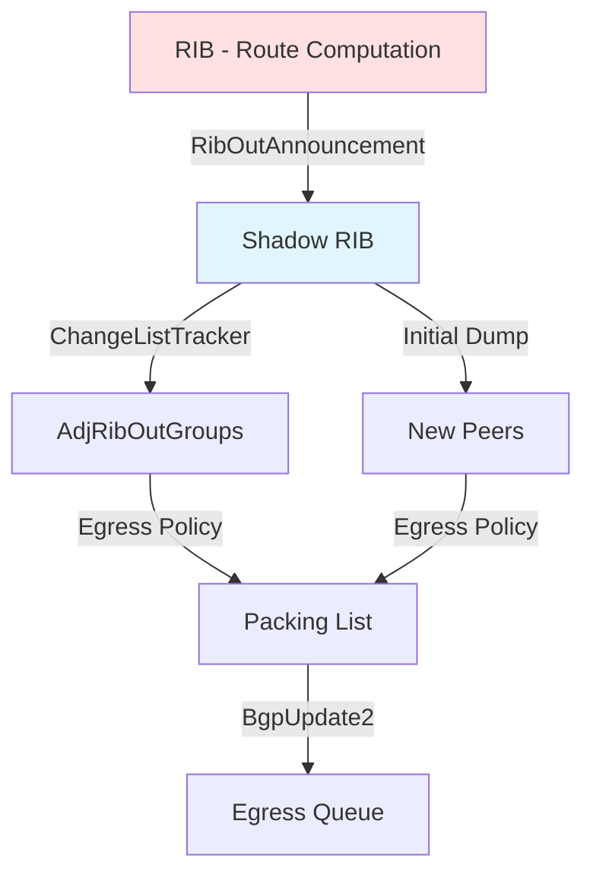

# Shadow RIB Integration

## Overview

The Shadow RIB is the central repository of routing information that serves as the source of truth for route advertisements in BGP++. It maintains the best paths and multipaths computed by the RIB and provides efficient change tracking for the egress pipeline.

## Architecture

### Shadow RIB in the BGP++ Pipeline



### Key Responsibilities

1. **State Storage**: Maintain computed best paths and ECMP multipaths
2. **Change Tracking**: Publish route updates to ChangeListTracker
3. **Initial Dumps**: Provide full RIB snapshot for new sessions
4. **Query Interface**: Support lookups for specific prefixes

## Data Structures

### ShadowRibEntry

The core data structure representing a route in the Shadow RIB:

```cpp
struct ShadowRibEntry {
  // The prefix (network address)
  folly::CIDRNetwork prefix;

  // Best path (for non-ECMP scenarios)
  std::unique_ptr<ShadowRibRoute> bestpath;

  // All ECMP multipaths (for add-path scenarios)
  folly::F14FastMap<uint32_t, std::unique_ptr<ShadowRibRoute>> multipaths;

  // Switch ID (for hardware programming)
  std::optional<uint32_t> switchId;

  // ECMP metadata
  uint32_t multiPathSize{0};
  uint64_t aggregateReceivedUcmpWeight{0};
  uint64_t aggregateLocalUcmpWeight{0};
  uint64_t ribPolicyUcmpWeight{0};

  // Installation tracking
  bool newlyInstalledInLocalRib{false};
  std::optional<std::chrono::steady_clock::time_point> installTimeStamp;
};
```

### ShadowRibRoute

Represents an individual path:

```cpp
struct ShadowRibRoute {
  // BGP attributes for this path
  std::shared_ptr<const BgpPath> attrs;

  // Originating peer
  PeerId peer;

  // Path ID for add-path
  uint32_t pathIdToSend{kDefaultPathID};

  // Route state flags
  ShadowRibRouteFlags flags{0};
};
```

### Shadow RIB Container

```cpp
// In PeerManager.h
using ShadowRibEntriesMap = folly::F14FastMap<
    folly::CIDRNetwork,
    std::unique_ptr<TrackableObject<ShadowRibEntry>>>;

ShadowRibEntriesMap shadowRibEntries_;
```

**Key Properties**:
- Each entry wrapped in `TrackableObject` for change tracking
- Fast lookup by prefix
- Shared across all consumers (update groups and peers)

## Route State Flags

Routes in Shadow RIB have flags indicating their state:

```cpp
enum ShadowRibRouteFlags : uint8_t {
  IN_UPDATE = 0x01,     // Route being added/updated
  IN_WITHDRAW = 0x02,   // Route being withdrawn
};

// Helper functions
bool isShadowRibRouteInUpdate(ShadowRibRouteFlags flags) {
  return (flags & ShadowRibRouteFlags::IN_UPDATE) != 0;
}

bool isShadowRibRouteInWithdraw(ShadowRibRouteFlags flags) {
  return (flags & ShadowRibRouteFlags::IN_WITHDRAW) != 0;
}
```

## Update Flow

### Route Announcement

```cpp
// 1. RIB computes new best path
RibOutAnnouncement announcement;
announcement.entries.emplace_back(
    prefix,
    pathId,
    peer,
    attrs,
    /* ... */
);

// 2. PeerManager receives announcement
void PeerManager::handleShadowRibEntryAnnouncement(
    const RibOutAnnouncement& announcement) {

  for (const auto& entry : announcement.entries) {
    auto& trackedEntry = shadowRibEntries_[entry.prefix];

    if (!trackedEntry) {
      // New prefix - create TrackableObject
      trackedEntry = std::make_unique<TrackableObject<ShadowRibEntry>>(
          ShadowRibEntry{.prefix = entry.prefix}
      );
    }

    auto& srEntry = trackedEntry->get();

    // Update bestpath
    srEntry.bestpath = std::make_unique<ShadowRibRoute>(
        ShadowRibRoute{
            .attrs = entry.attrs,
            .peer = entry.peerId,
            .pathIdToSend = entry.pathId,
            .flags = ShadowRibRouteFlags::IN_UPDATE
        }
    );

    // Update metadata
    srEntry.switchId = entry.switchId;
    srEntry.multiPathSize = entry.multiPathSize;
    // ... other fields

    // 3. Publish change to all consumers
    if (enableChangeListTracker_) {
      changeListTracker_->publish(
          trackedEntry.get(),
          allConsumersBitmap_
      );
    }
  }
}
```

### Route Withdrawal

```cpp
void PeerManager::handleShadowRibEntryWithdrawal(
    const RibOutWithdrawal& withdrawal) {

  for (const auto& prefix : withdrawal.prefixes) {
    auto it = shadowRibEntries_.find(prefix);
    if (it == shadowRibEntries_.end()) {
      // Prefix not in Shadow RIB, nothing to withdraw
      continue;
    }

    auto& trackedEntry = it->second;
    auto& srEntry = trackedEntry->get();

    // Mark bestpath as withdrawn
    if (srEntry.bestpath) {
      srEntry.bestpath->flags = ShadowRibRouteFlags::IN_WITHDRAW;

      // Publish withdrawal
      if (enableChangeListTracker_) {
        changeListTracker_->publish(
            trackedEntry.get(),
            allConsumersBitmap_
        );
      }
    }

    // After all consumers process withdrawal, clean up
    // (handled by processChangeItemCompleteCallback)
  }
}
```

### Multipath Updates (Add-Path)

```cpp
// Update multipaths for ECMP scenarios
for (const auto& entry : announcement.addPathEntries) {
  auto& srEntry = shadowRibEntries_[entry.prefix]->get();

  // Insert or update multipath
  srEntry.multipaths[entry.pathId] = std::make_unique<ShadowRibRoute>(
      ShadowRibRoute{
          .attrs = entry.attrs,
          .peer = entry.peerId,
          .pathIdToSend = entry.pathId,
          .flags = ShadowRibRouteFlags::IN_UPDATE
      }
  );

  srEntry.multiPathSize = srEntry.multipaths.size();

  // Publish change
  changeListTracker_->publish(/* ... */);
}
```

## Initial RIB Dump

When a new peer session is established, it needs the full RIB:

### Traditional Per-Peer Dump

```cpp
folly::coro::Task<void> PeerManager::processRibDumpReq(RibDumpReq req) {
  auto adjRib = adjRibs_.find(req.peerId);

  RibOutAnnouncement announcement;
  announcement.initialDump = true;

  // Walk all Shadow RIB entries
  for (const auto& [prefix, trackedEntry] : shadowRibEntries_) {
    auto& srEntry = trackedEntry->get();

    // Skip if already on change list for this consumer
    if (enableChangeListTracker_ &&
        changeListTracker_->isConsumerSetOnTrackableObject(
            trackedEntry.get(), adjRib->second->getChangeListConsumer())) {
      continue;
    }

    // Include bestpath or multipaths based on add-path capability
    if (!req.sendAddPath) {
      if (srEntry.bestpath &&
          !isShadowRibRouteInWithdraw(srEntry.bestpath->flags)) {
        announcement.entries.emplace_back(
            prefix,
            kDefaultPathID,
            srEntry.bestpath->peer,
            srEntry.bestpath->attrs,
            /* metadata */
        );
      }
    } else {
      for (const auto& [pathId, multipath] : srEntry.multipaths) {
        if (multipath &&
            !isShadowRibRouteInWithdraw(multipath->flags)) {
          announcement.addPathEntries.emplace_back(
              prefix,
              multipath->pathIdToSend,
              multipath->peer,
              multipath->attrs,
              /* metadata */
          );
        }
      }
    }

    // Send in chunks to avoid huge messages
    if (announcement.entries.size() >= kRibChunkSize) {
      co_await adjRib->second->processRibOutMessage(
          std::make_shared<RibOutAnnouncement>(announcement)
      );
      announcement.entries.clear();
    }
  }

  // Send final chunk with EoR
  announcement.sendWithEoR = true;
  co_await adjRib->second->processRibOutMessage(
      std::make_shared<RibOutAnnouncement>(announcement)
  );
}
```

### Update Group Initial Dump

```cpp
folly::coro::Task<void> AdjRibOutGroup::buildInitialDumpFromShadowRib() {
  XLOGF(INFO, "Group {} starting initial dump from shadow RIB", groupName_);

  if (!shadowRibEntries_) {
    // No shadow RIB reference
    state_ = UpdateGroupState::IDLE;
    co_return;
  }

  state_ = UpdateGroupState::BUILDING_PACKING_LIST;

  RibOutAnnouncement announcement;
  announcement.initialDump = true;

  // Walk all Shadow RIB entries
  for (const auto& [prefix, srEntryPtr] : *shadowRibEntries_) {
    if (!srEntryPtr) continue;

    auto& srEntry = srEntryPtr->get();

    // Process based on add-path configuration
    if (!groupKey_.sendAddPath) {
      // Bestpath only
      const auto bestpath = srEntry.bestpath;
      if (bestpath && !isShadowRibRouteInWithdraw(bestpath->flags)) {
        announcement.entries.emplace_back(
            prefix,
            kDefaultPathID,
            bestpath->peer,
            bestpath->attrs,
            /* metadata */
        );
      }
    } else {
      // All multipaths
      for (const auto& [_, multipath] : srEntry.multipaths) {
        if (multipath && !isShadowRibRouteInWithdraw(multipath->flags)) {
          announcement.addPathEntries.emplace_back(
              prefix,
              multipath->pathIdToSend,
              multipath->peer,
              multipath->attrs,
              /* metadata */
          );
        }
      }
    }
  }

  // Process entire announcement (builds packing list)
  processRibOutAnnouncement(announcement);

  XLOGF(INFO, "Group {} completed initial dump, packing list size={}",
        groupName_, attrToPrefixMap_.size());

  state_ = UpdateGroupState::IDLE;
  co_return;
}
```

## Change List Integration

### Publishing Changes

Shadow RIB integrates with ChangeListTracker:

```cpp
// Global change tracker in PeerManager
std::shared_ptr<ChangeTracker<ShadowRibEntry>> changeListTracker_;

// On RIB initialization
changeListTracker_ = std::make_shared<ChangeTracker<ShadowRibEntry>>(
    "A tracker for tracking ShadowRibEntries_ updates"
);

// Set completion callback
changeListTracker_->setGlobalOnChangeProcessedCallback(
    [this](TrackableObject<ShadowRibEntry>* trackedObject) {
      processChangeItemCompleteCallback(trackedObject);
    }
);
```

### Cleanup After Consumption

After all consumers process a change:

```cpp
void PeerManager::processChangeItemCompleteCallback(
    TrackableObject<ShadowRibEntry>* trackedObject) {

  auto& srEntry = trackedObject->get();

  // Check if all consumers processed
  if (!trackedObject->consumerBitmap_.none()) {
    return;  // Still pending consumers
  }

  // All consumers done - clean up withdrawals
  if (srEntry.bestpath &&
      isShadowRibRouteInWithdraw(srEntry.bestpath->flags)) {
    // Remove withdrawn bestpath
    srEntry.bestpath.reset();

    // If no multipaths remain, remove entire entry
    if (srEntry.multipaths.empty()) {
      auto it = shadowRibEntries_.find(srEntry.prefix);
      if (it != shadowRibEntries_.end()) {
        shadowRibEntries_.erase(it);
      }
    }
  }

  // Clean up withdrawn multipaths
  for (auto it = srEntry.multipaths.begin();
       it != srEntry.multipaths.end(); ) {
    if (isShadowRibRouteInWithdraw(it->second->flags)) {
      it = srEntry.multipaths.erase(it);
    } else {
      ++it;
    }
  }
}
```

## Memory Management

### Sharing BGP Attributes

Shadow RIB shares `BgpPath` objects via `shared_ptr`:

```cpp
struct ShadowRibRoute {
  std::shared_ptr<const BgpPath> attrs;  // Shared across entries
  // ...
};
```

**Benefits**:
- Multiple Shadow RIB entries with identical attributes share single `BgpPath`
- Significant memory savings for routes from same peer
- Automatic cleanup via reference counting

### Entry Lifecycle

```
1. Route announced:
   └─> Create ShadowRibEntry
   └─> Wrap in TrackableObject
   └─> Insert in shadowRibEntries_

2. Route updated:
   └─> Update existing ShadowRibEntry
   └─> Publish change via ChangeListTracker

3. Route withdrawn:
   └─> Set IN_WITHDRAW flag
   └─> Publish change
   └─> After all consumers process:
       └─> Remove ShadowRibRoute
       └─> If no routes remain: erase ShadowRibEntry
```

## Performance Characteristics

### Lookup Performance

- **Data Structure**: `folly::F14FastMap` (fast hash map)
- **Lookup**: O(1) average case
- **Iteration**: Efficient for full RIB walks

### Memory Overhead

Per prefix:
- `ShadowRibEntry`: ~200 bytes
- `TrackableObject` wrapper: ~50 bytes
- `BgpPath` (shared): ~300 bytes (amortized across many entries)

**Example**:
- 1M prefixes
- Average 2 attributes shared per 100 prefixes
- Memory: 250 MB + 3 MB (attributes) = **253 MB**

### Change Propagation Efficiency

**Traditional RIB → Peer Model**:
- RIB sends announcement to each peer individually
- Complexity: O(N) where N = peers

**Shadow RIB + ChangeList Model**:
- RIB → Shadow RIB: O(1) update
- Shadow RIB → ChangeListTracker: O(1) publish
- ChangeListTracker → Consumers: O(C) where C = update groups (C << N)

## Consumer Processing

### AdjRibOutGroup Processing

When consumer drains change list:

```cpp
void AdjRibOutGroup::processShadowRibEntryChange(
    ShadowRibEntry& srEntry) {

  RibOutAnnouncement announcement;
  announcement.initialDump = false;

  if (groupKey_.sendAddPath) {
    // Process all multipaths
    for (const auto& [_, multipath] : srEntry.multipaths) {
      if (!multipath) continue;

      if (isShadowRibRouteInUpdate(multipath->flags)) {
        // Announcement
        announcement.addPathEntries.push_back(
            RibOutAnnouncementEntry{
                .prefix = srEntry.prefix,
                .pathId = multipath->pathIdToSend,
                .peerId = multipath->peer,
                .attrs = multipath->attrs,
                /* metadata */
            }
        );
      } else if (isShadowRibRouteInWithdraw(multipath->flags)) {
        // Withdrawal
        processGroupRibWithdraw(srEntry.prefix, multipath->pathIdToSend);
      }
    }
  } else {
    // Process bestpath only
    if (srEntry.bestpath) {
      if (isShadowRibRouteInUpdate(srEntry.bestpath->flags)) {
        announcement.entries.push_back(/* ... */);
      } else if (isShadowRibRouteInWithdraw(srEntry.bestpath->flags)) {
        processGroupRibWithdraw(srEntry.prefix, kDefaultPathID);
      }
    }
  }

  // Process announcement into packing list
  if (!announcement.entries.empty() || !announcement.addPathEntries.empty()) {
    processRibOutAnnouncement(announcement);
  }
}
```

## Code References

### Core Files

- **ShadowRibTypes.h** (`fbcode/neteng/fboss/bgp/cpp/adjrib/ShadowRibTypes.h`)
  - `ShadowRibEntry` structure
  - `ShadowRibRoute` structure
  - `ShadowRibRouteFlags` enum

- **PeerManager.cpp** (`fbcode/neteng/fboss/bgp/cpp/peer/PeerManager.cpp`)
  - `shadowRibEntries_` container
  - `handleShadowRibEntryAnnouncement()`
  - `handleShadowRibEntryWithdrawal()`
  - `processRibDumpReq()`
  - `processChangeItemCompleteCallback()`

- **AdjRibGroup.cpp** (`fbcode/neteng/fboss/bgp/cpp/adjrib/AdjRibGroup.cpp`)
  - `buildInitialDumpFromShadowRib()`
  - `processShadowRibEntryChange()`

## Monitoring

### Key Metrics

| Metric | Description |
|--------|-------------|
| `shadowRibEntries_.size()` | Total prefixes in Shadow RIB |
| `changeListTracker_->size()` | Pending changes to propagate |
| Initial dump duration | Time to complete RIB dump |

### Logging

```cpp
XLOGF(INFO, "Shadow RIB now contains {} prefixes",
      shadowRibEntries_.size());

XLOGF(DBG2, "Published change for {} to {} consumers",
      folly::IPAddress::networkToString(prefix),
      consumerCount);
```

## Related Documentation

- [Egress Pipeline Overview](egress-pipeline.md)
- [Change List Integration](changelist-integration.md)
- [Egress Backpressure](egress-backpressure.md)
- [Out-Delay](out-delay.md)
- [BGP UPDATE Serialization](serialization.md)
