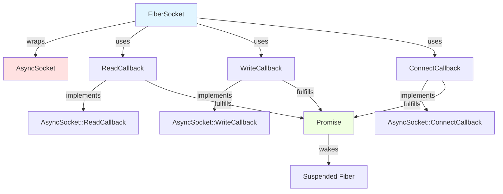

# FiberSocket and AsyncSocket Integration

## Overview

`FiberSocket` is a fiber-aware wrapper around Folly's `AsyncSocket` that enables BGP++ to perform asynchronous I/O operations using **fibers (stackful coroutines)** instead of traditional callbacks. This abstraction bridges the gap between callback-based async I/O and fiber-based concurrent programming.

## Architecture

### The Problem: Callback Hell

Traditional asynchronous I/O with `AsyncSocket` requires callbacks:

```cpp
// Traditional callback-based approach
class MyReadCallback : public AsyncSocket::ReadCallback {
  void readDataAvailable(size_t len) override {
    // Process data
    // Call another async operation
    // Need another callback...
  }

  void readErr(const AsyncSocketException& ex) override {
    // Handle error
  }
};

// Usage requires managing callback lifetime, state machines, etc.
socket->setReadCB(&myCallback);
```

**Problems**:
- Callback hell: deeply nested callbacks for sequential operations
- State management: manually tracking operation state
- Error handling: scattered across multiple callback methods
- Code readability: logic flow is non-linear

### The Solution: Fiber-Aware Wrappers

`FiberSocket` wraps `AsyncSocket` and provides synchronous-looking APIs that suspend the current fiber:

```cpp
// Fiber-based approach with FiberSocket
auto result = fiberSocket.read(1024);  // Looks synchronous!
if (result.hasValue()) {
  auto buf = std::move(result.value());
  // Process data linearly
} else {
  // Handle error
}
```

**Benefits**:
- Linear code flow: reads like synchronous code
- Automatic suspension: fiber suspends during I/O, other fibers run
- Simple error handling: `Expected<T, E>` return values
- No callback lifetime management

## How FiberSocket Works

### Core Principle: Await Pattern

FiberSocket uses Folly's `folly::fibers::await()` to bridge callbacks and fibers:

```cpp
template <typename F>
auto await(F&& func) {
  Promise<T> promise;

  // Schedule callback on event loop
  func(std::move(promise));

  // Suspend current fiber until promise is fulfilled
  return promise.getFuture().getVia(currentFiber);
}
```

**What happens**:
1. Fiber calls `fiberSocket.read()`
2. FiberSocket installs a callback on AsyncSocket
3. `await()` suspends the current fiber
4. Event loop continues, other fibers run
5. When data arrives, AsyncSocket invokes callback
6. Callback fulfills promise, waking the suspended fiber
7. Fiber resumes with the result

### Internal Components



## AsyncSocket APIs Used

### 1. Reading Data

**FiberSocket API**:
```cpp
folly::Expected<std::unique_ptr<folly::IOBuf>, FiberSocketError>
read(uint64_t maxSize, std::chrono::milliseconds timeout = 0ms);
```

**AsyncSocket APIs Used**:

#### setReadCB()
```cpp
// Install read callback
socket_->setReadCB(&readCallback);

// Callback interface
class ReadCallback : public AsyncSocket::ReadCallback {
  // Called to allocate buffer for incoming data
  void getReadBuffer(void** buf, size_t* len) override;

  // Called when data arrives
  void readDataAvailable(size_t len) override;

  // Called on EOF (connection closed)
  void readEOF() override;

  // Called on error
  void readErr(const AsyncSocketException& ex) override;
};
```

**Implementation Flow**:

```cpp
// FiberSocket::read() implementation
folly::Expected<std::unique_ptr<folly::IOBuf>, FiberSocketError>
FiberSocket::read(uint64_t maxSize, std::chrono::milliseconds timeout) {
  // 1. Allocate buffer
  auto buf = folly::IOBuf::createCombined(maxSize);

  // 2. Create callback wrapper
  ReadCallback cb{socket_, buf.get(), maxSize, timeout};

  // 3. Use await pattern
  auto bytesRead = await([this, &cb](Promise<size_t> promise) {
    cb.setPromise(std::move(promise));
    socket_->setReadCB(&cb);  // ← Install callback on AsyncSocket
  });

  // 4. Fiber resumes here when data arrives
  if (bytesRead > 0) {
    buf->append(bytesRead);
    return std::move(buf);
  } else {
    // EOF or error
    closed_ = true;
    return std::move(buf);
  }
}
```

**Key Points**:
- `getReadBuffer()` provides buffer address to AsyncSocket
- `readDataAvailable()` called when data arrives, fulfills promise
- `readEOF()` indicates connection closed (returns 0 bytes)
- `readErr()` handles errors, propagates via exception

### 2. Writing Data

**FiberSocket API**:
```cpp
folly::Expected<size_t, FiberSocketError>
write(std::unique_ptr<folly::IOBuf> buf);
```

**AsyncSocket API Used**:

#### writeChain()
```cpp
// Write entire IOBuf chain
socket_->writeChain(&writeCallback, std::move(buf));
```

**Why writeChain()?**

BGP UPDATE messages may consist of **chained IOBufs** (linked list):

```
IOBuf chain:
  Head IOBuf → IOBuf 2 → IOBuf 3 → (back to Head)
  [Header]     [Attrs]    [NLRIs]
```

`writeChain()` writes the entire chain efficiently using `iovec` (vectored I/O):
- **Single system call**: All buffers written in one `writev()`
- **No copying**: Direct DMA from IOBuf memory
- **Efficient**: Kernel gathers data from multiple buffers

**Implementation Flow**:

```cpp
// FiberSocket::write() implementation
folly::Expected<size_t, FiberSocketError>
FiberSocket::write(std::unique_ptr<folly::IOBuf> buf) {
  auto length = buf->computeChainDataLength();

  WriteCallback cb;

  // Use await pattern
  await([this, &cb, buf = std::move(buf)](Promise<void> promise) mutable {
    cb.setPromise(std::move(promise));
    socket_->writeChain(&cb, std::move(buf));  // ← Write to AsyncSocket
  });

  // Fiber resumes here when write completes
  return length;
}
```

**WriteCallback Interface**:
```cpp
class WriteCallback : public AsyncSocket::WriteCallback {
  // Called when write succeeds
  void writeSuccess() override {
    promise_->setValue();  // Wake suspended fiber
  }

  // Called on write error (with partial bytes written count)
  void writeErr(size_t bytesWritten, const AsyncSocketException& ex) override {
    promise_->setException(ex);  // Wake fiber with error
  }
};
```

### 3. Connecting to Peer

**FiberSocket API**:
```cpp
static folly::Expected<FiberSocket, FiberSocketError>
makeConnectedSocket(
    const folly::SocketAddress& destAddr,
    std::chrono::milliseconds connectTimeout,
    const folly::SocketAddress& bindAddr);
```

**AsyncSocket API Used**:

#### connect()
```cpp
socket_->connect(
    &connectCallback,
    destAddr,           // Remote peer address
    connectTimeout,     // Timeout in milliseconds
    socketOptions,      // TCP options (e.g., TCP_NODELAY)
    bindAddr            // Local address to bind
);
```

**Implementation Flow**:

```cpp
// FiberSocket::makeConnectedSocket() implementation
folly::Expected<FiberSocket, FiberSocketError>
FiberSocket::makeConnectedSocket(const folly::SocketAddress& destAddr, ...) {
  // 1. Create AsyncSocket
  auto socket = AsyncSocket::newSocket(evb);

  // 2. Create connect callback
  ConnectCallback cb(socket);

  // 3. Use await pattern
  await([&cb, &socket, destAddr, ...](Promise<void> promise) {
    cb.setPromise(std::move(promise));
    socket->connect(&cb, destAddr, timeout, options, bindAddr);
  });

  // 4. Fiber resumes here when connection succeeds
  return FiberSocket(std::move(socket));
}
```

**ConnectCallback Interface**:
```cpp
class ConnectCallback : public AsyncSocket::ConnectCallback {
  // Called when TCP handshake completes
  void connectSuccess() override {
    socket_->cancelConnect();  // Clean up
    promise_->setValue();      // Wake fiber
  }

  // Called on connection failure
  void connectErr(const AsyncSocketException& ex) override {
    socket_->cancelConnect();
    promise_->setException(ex);  // Wake fiber with error
  }
};
```

### 4. Socket Lifecycle Management

**AsyncSocket APIs**:

#### close()
```cpp
// Graceful close (TCP FIN)
void FiberSocket::close() {
  if (socket_) {
    socket_->close();  // Sends FIN, drains send buffer
  }
  closed_ = true;
}
```

#### closeWithReset()
```cpp
// Abortive close (TCP RST)
void FiberSocket::closeWithReset() {
  if (socket_) {
    socket_->closeWithReset();  // Sends RST, discards buffers
  }
  closed_ = true;
}
```

#### shutdownWrite()
```cpp
// Half-close (send FIN, but still receive)
void FiberSocket::shutdownWrite() {
  if (socket_) {
    socket_->shutdownWrite();  // Shutdown send side only
  }
  // Don't mark as closed (can still read)
}
```

### 5. Address Information

**AsyncSocket APIs**:

#### getPeerAddress() / getLocalAddress()
```cpp
// Get remote peer address (IP + port)
void AsyncSocket::getPeerAddress(SocketAddress* addr) const;

// Get local socket address (IP + port)
void AsyncSocket::getLocalAddress(SocketAddress* addr) const;

// FiberSocket caches these on construction
FiberSocket::FiberSocket(std::shared_ptr<AsyncSocket> socket) {
  socket_->getPeerAddress(&peerAddress_);  // Cache peer address
  socket_->getLocalAddress(&localAddress_); // Cache local address
}

// Later access is just a member variable lookup
folly::SocketAddress FiberSocket::getPeerAddress() const {
  return peerAddress_;  // No syscall!
}
```

**Why Cache?**

Addresses don't change during connection lifetime, so caching avoids repeated syscalls.

### 6. Buffer Monitoring

**AsyncSocket API Used**:

#### setBufferCallback()
```cpp
socket_->setBufferCallback(&bufferCallback_);

class FiberSocketBufferCallback : public AsyncTransport::BufferCallback {
  // Called when socket send buffer fills up
  void onEgressBuffered() override {
    totalBufferedEvents_++;
    lastBufferedTimeMs_ = getCurrentTimeMs();
  }

  // Called when buffer drains
  void onEgressBufferCleared() override {}
};
```

**Purpose**:
- Track how often TCP send buffer fills up (backpressure indicator)
- Monitor network congestion
- Expose metrics for debugging slow peers

### 7. Socket Options

**AsyncSocket APIs**:

#### getSockOpt() / setSockOpt()
```cpp
template <typename T>
int FiberSocket::getSockOpt(int level, int optname, T* optval, socklen_t* len) {
  return socket_->getSockOpt(level, optname, (void*)optval, len);
}

template <typename T>
int FiberSocket::setSockOpt(int level, int optname, const T* optval) {
  return socket_->setSockOpt(level, optname, optval);
}
```

**Common Options Used in BGP++**:
```cpp
// Disable Nagle's algorithm (send small packets immediately)
int flag = 1;
socket.setSockOpt(IPPROTO_TCP, TCP_NODELAY, &flag);

// Set TCP keepalive
int keepalive = 1;
socket.setSockOpt(SOL_SOCKET, SO_KEEPALIVE, &keepalive);

// Set send/receive buffer sizes
int bufSize = 262144;  // 256 KB
socket.setSockOpt(SOL_SOCKET, SO_SNDBUF, &bufSize);
socket.setSockOpt(SOL_SOCKET, SO_RCVBUF, &bufSize);
```

## FiberBgpPeer Integration

### Message Processing Pipeline


### Egress Path (Sending BGP UPDATEs)

```cpp
// FiberBgpPeer::processEgressBgpMessageLoop()
folly::coro::Task<void>
FiberBgpPeer::processEgressBgpMessageLoop() {
  while (true) {
    // 1. Dequeue from AdjRib (may suspend if queue empty)
    auto maybeMsg = co_await boundedInputQueue_->pop();

    if (!maybeMsg) {
      break;  // Shutdown signal
    }

    // 2. Serialize BgpUpdate2 to IOBuf
    std::unique_ptr<folly::IOBuf> serializedPdu;
    folly::variant_match(**maybeMsg,
      [&](std::shared_ptr<const BgpUpdate2> update) {
        serializedPdu = serializeBgpUpdate2(*update);
      },
      [&](const UpdateDescriptor& descriptor) {
        // Zero-copy path: clone shared PDU
        serializedPdu = descriptor.serializedGroupPDU->clone();
        // Mutate nexthop bytes...
      },
      // ... other types
    );

    // 3. Write to FiberSocket (suspends until write completes)
    auto result = sock_.write(std::move(serializedPdu));

    if (!result.hasValue()) {
      // Write failed - tear down session
      errorQueue_.put(BgpSocketError{result.error()});
      break;
    }
  }
}
```

**Key Points**:
- Fiber suspends on `pop()` if queue empty (waits for AdjRib)
- Fiber suspends on `write()` until AsyncSocket completes (TCP send buffer drains)
- Other fibers (read loop, keepalive timer) run while this fiber is suspended

### Ingress Path (Receiving BGP UPDATEs)

```cpp
// FiberBgpPeer::readSocketLoop()
void FiberBgpPeer::readSocketLoop() {
  while (true) {
    // 1. Read from FiberSocket (suspends until data arrives)
    auto result = sock_.read(kMaxBgpMessageSize);

    if (!result.hasValue()) {
      // Read error or EOF
      errorQueue_.put(BgpSocketError{result.error()});
      break;
    }

    auto buf = std::move(result.value());

    if (buf->length() == 0) {
      // EOF - peer closed connection
      break;
    }

    // 2. Feed to parser
    parser_.append(std::move(buf));

    // 3. Extract parsed messages
    while (auto msg = parser_.getNextMessage()) {
      // 4. Push to ingress queue (to AdjRib)
      folly::variant_match(msg,
        [&](BgpUpdate2 update) {
          outputQueue_->push(
              std::make_shared<const BgpUpdate2>(std::move(update))
          );
        },
        // ... other message types
      );
    }
  }
}
```

**Key Points**:
- Runs in separate fiber (concurrent with write loop)
- Suspends on `read()` until data arrives
- Parser accumulates partial messages
- Non-blocking push to AdjRib queue

## Error Handling

### AsyncSocketException Types

FiberSocket propagates AsyncSocket errors via `folly::Expected`:

```cpp
enum class AsyncSocketExceptionType {
  NOT_OPEN,           // Socket not connected
  ALREADY_OPEN,       // Already connected
  TIMED_OUT,          // Operation timeout
  END_OF_FILE,        // Connection closed by peer
  INTERRUPTED,        // System call interrupted
  BAD_ARGS,           // Invalid arguments
  CORRUPTED_DATA,     // SSL/TLS error
  INTERNAL_ERROR,     // Internal folly error
  NOT_SUPPORTED,      // Operation not supported
  INVALID_STATE,      // Invalid state transition
  SSL_ERROR,          // SSL-specific error
  COULD_NOT_BIND,     // Bind failed
  SASL_HANDSHAKE_TIMEOUT,
  NETWORK_ERROR       // Generic network error
};
```

### Error Propagation Pattern

```cpp
// FiberSocket returns Expected<T, FiberSocketError>
auto result = fiberSocket.read(1024);

if (result.hasValue()) {
  // Success path
  auto buf = std::move(result.value());
  processData(buf);
} else {
  // Error path
  auto& error = result.error();

  std::visit(FiberSocketErrorVisitor{},
    error,
    [](const AsyncSocketException& ex) {
      XLOG(ERR) << "AsyncSocket error: " << ex.what();
    },
    [](const FiberGenericSocketError& ex) {
      XLOG(ERR) << "FiberSocket error: " << ex.msg_;
    }
  );
}
```

## Performance Characteristics

### Memory Overhead

**Per FiberSocket**:
- `AsyncSocket` shared_ptr: 16 bytes
- Cached addresses: 64 bytes (2 × SocketAddress)
- Buffer callback: 16 bytes
- State flags: 1 byte
- **Total: ~97 bytes** (minimal overhead)

### CPU Overhead

**Callback Installation/Removal**:
- `setReadCB()`: O(1) - just pointer assignment
- `writeChain()`: O(1) - queues write, may coalesce

**Fiber Context Switches**:
- Suspend: ~100 ns (save fiber stack pointer)
- Resume: ~100 ns (restore stack pointer)
- **Much cheaper than thread context switch** (~1-10 µs)

### I/O Efficiency

**Reading**:
- Direct buffer allocation: `IOBuf::createCombined()`
- No copies: Data read directly into IOBuf
- Typical read size: 4 KB (BGP message size)

**Writing**:
- Vectored I/O: `writev()` for IOBuf chains
- No copies: DMA from IOBuf memory
- Typical write: 1-4 KB (BGP UPDATE)

## Debugging

### Common Issues

#### 1. "Attempted to read from closed fiber socket"

**Cause**: Reading after connection closed

**Fix**: Check `sock_.readable()` before read, handle EOF gracefully

#### 2. "writeChain failed with EPIPE"

**Cause**: Writing to socket after peer closed (broken pipe)

**Fix**: Handle write errors, don't retry on EPIPE

#### 3. Fiber Deadlock

**Cause**: Circular dependency (fiber A waits for B, B waits for A)

**Fix**: Use timeouts, avoid blocking operations in callbacks

### Logging

```cpp
// FiberSocket logs at DBG5 level
XLOG(DBG5) << "FiberSocket::read(), expecting max len " << maxSize;
XLOG(DBG5) << "FiberSocket::write(), len " << length;
XLOG(DBG5) << "readDataAvailable: " << len << " bytes";
```

**Enable verbose logging**:
```bash
# Set log level for nettools.bgplib.fibers
--v=5 --vmodule=FiberSocket=5
```

## Code References

### Core Files

- **FiberSocket** (`nettools/bgplib/fibers/FiberSocket.{h,cpp}`)
  - `read()` / `write()` - Main I/O operations
  - `makeConnectedSocket()` - Factory for outbound connections
  - ReadCallback / WriteCallback - AsyncSocket callback wrappers

- **FiberBgpPeer** (`nettools/bgplib/fibers/FiberBgpPeer.{h,cpp}`)
  - `readSocketLoop()` - Ingress fiber
  - `processEgressBgpMessageLoop()` - Egress fiber
  - Integration with AdjRib queues

- **AsyncSocket** (`folly/io/async/AsyncSocket.{h,cpp}`)
  - Underlying transport layer
  - Event loop integration

## Related Documentation

- [Egress Pipeline](../egress-pipeline/egress-pipeline.md) - How messages reach FiberSocket
- [Egress Backpressure](../egress-pipeline/egress-backpressure.md) - Queue flow control
- [BGP UPDATE Serialization](../egress-pipeline/serialization.md) - Creating IOBufs for transmission

## References

- **Folly AsyncSocket**: https://github.com/facebook/folly/blob/main/folly/io/async/AsyncSocket.h
- **Folly Fibers**: https://github.com/facebook/folly/blob/main/folly/fibers/README.md
- **BGP RFC 4271**: BGP-4 Specification
